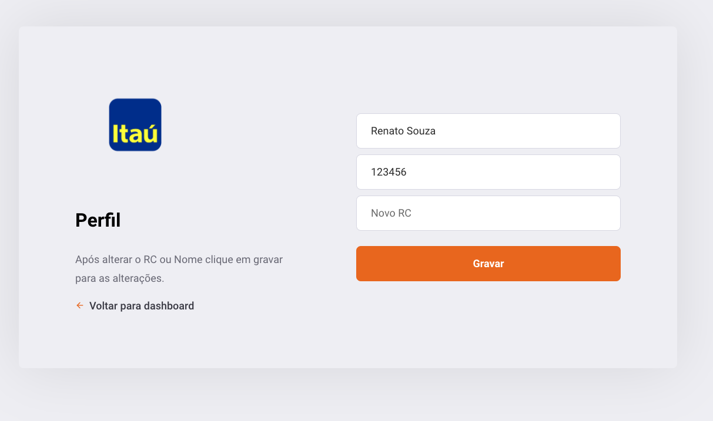

## Teste Itau 

**Notas: Esse projeto constitui por um fronend seguindo aos pedidos solicitado**


# Tecnologias Utilizadas 🚀
React JS ⚛️ <br />
CSS 💅🏻 <br />
React Feather Icons ⚡️ <br />
Docker ⚡️ <br />
Typescript in backend 🖥

Para executar o projeto execute o seguinte comando: 🚀 

```js
    docker-compose up 🥊
```

Obs: caso não tenha docker execute o comando abaixo:
```js
  npm start 🥊
  npm dev:server 🥊
```

# Imagens 📷

<h2>Web Front</h1>
<p align="center">
  
  
  
  
  
  
  
  
  
  
</p>


